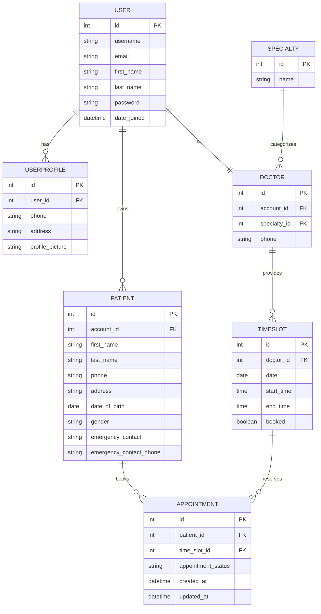

# Clinic System Design Document

## Models

### Core Models

#### User
- **ID**: Primary key
- **Username**: Unique identifier for login
- **Email**: Contact email
- **First Name**: User's first name
- **Last Name**: User's last name
- **Password**: Encrypted password
- **Groups**: User role assignment (User, Doctor, Admin)

#### UserProfile (Extended User Model)
- **User**: One-to-one relationship with User
- **Phone**: Contact phone number
- **Address**: Physical address
- **Profile Picture**: Optional profile image

#### Specialty
- **ID**: Primary key
- **Name**: Medical specialty name (e.g., Cardiology, General Practice)

#### Patient
- **Account**: Foreign key to User model
- **First Name**: Patient's first name
- **Last Name**: Patient's last name
- **Phone**: Contact phone number
- **Address**: Physical address
- **Date of Birth**: Patient's DOB
- **Gender**: Male/Female/Other
- **Emergency Contact**: Emergency contact person name
- **Emergency Contact Phone**: Emergency contact phone number

#### Doctor
- **Account**: One-to-one relationship with User
- **Specialty**: Foreign key to Specialty model
- **Phone**: Contact phone number

#### TimeSlot
- **Doctor**: Foreign key to Doctor
- **Date**: Available date
- **Start Time**: Time slot start
- **End Time**: Time slot end
- **Booked**: Boolean status (True/False)

#### Appointment
- **Patient**: Foreign key to Patient
- **Time Slot**: One-to-one relationship with TimeSlot
- **Status**: BOOKED/CANCELLED/DONE
- **Created At**: Timestamp for creation
- **Updated At**: Timestamp for updates

## Entity Relationship Diagram

## User Roles and Permissions

### Role-Based Access Control

#### Patient Role
- **Dashboard**: View personal appointments and patients
- **Booking**: Book appointments with available doctors
- **Profile Management**: Edit personal information
- **Patient Management**: Add/edit multiple patient profiles

#### Doctor Role
- **Dashboard**: View scheduled appointments
- **Calendar**: See appointment schedule
- **Patient Access**: View patient info for scheduled appointments
- **Time Management**: Manage availability through time slots

#### Admin Role
- **Admin Dashboard**: Full system overview
- **User Management**: Add/remove doctors and users
- **System Configuration**: Manage specialties and settings
- **Hijack Support**: Access user accounts for support

## Views and Functionality

### Authentication Views
- **Home**: Landing page with doctor listings and statistics
- **Register**: User signup with automatic group assignment
- **Login**: User authentication
- **Profile**: User profile management

### Patient Views
- **User Dashboard**: Personal appointments and patient management
- **Calendar**: Appointment visualization
- **Booking**: Appointment booking interface
- **Patient View**: Patient profile management
- **Add Patient**: Create new patient profiles

### Doctor Views
- **Doctor Dashboard**: Appointment schedule and management
- **Calendar**: Time slot and appointment view

### Admin Views
- **Admin Dashboard**: System overview with users and doctors
- **Add Doctor**: Create new doctor accounts
- **Doctor View**: Edit doctor information
- **Delete Doctor**: Remove doctor accounts

## UI/UX Design Principles

### Design System
- **Framework**: Bootstrap 5 for responsive design
- **Color Scheme**: Primary blue with muted grays
- **Typography**: Clean, readable fonts with proper hierarchy
- **Components**: Cards, buttons, forms with consistent styling
- **Icons**: Simple emoji icons for universal compatibility

### Responsive Design
- **Mobile-First**: Optimized for mobile devices
- **Breakpoints**: Tablet and desktop adaptations
- **Navigation**: Collapsible menu for small screens
- **Cards**: Flexible grid layouts

### User Experience
- **Progressive Disclosure**: Show relevant information based on user role
- **Clear Navigation**: Intuitive menu structure
- **Error Handling**: User-friendly error messages
- **Loading States**: Visual feedback during operations

## Security Considerations

### Authentication
- **Password Validation**: Configurable password requirements
- **Session Management**: Secure session handling
- **CSRF Protection**: Cross-site request forgery prevention
- **Role-Based Access**: Permission checks on all views

### Data Protection
- **Input Validation**: Form sanitization and validation
- **SQL Injection Prevention**: Django ORM usage
- **XSS Protection**: Template auto-escaping
- **Environment Variables**: Sensitive configuration protection

## Database Design

### Optimization
- **Indexes**: Foreign key and frequently queried fields
- **Select Related**: Query optimization for related objects
- **Prefetch Related**: Many-to-many relationship optimization
- **Constraints**: Unique constraints for data integrity

### Relationships
- **One-to-Many**: User to Patients, Doctor to TimeSlots
- **One-to-One**: User to UserProfile, User to Doctor
- **Many-to-Many**: Through appointment system
- **Foreign Keys**: Proper cascade delete behavior
